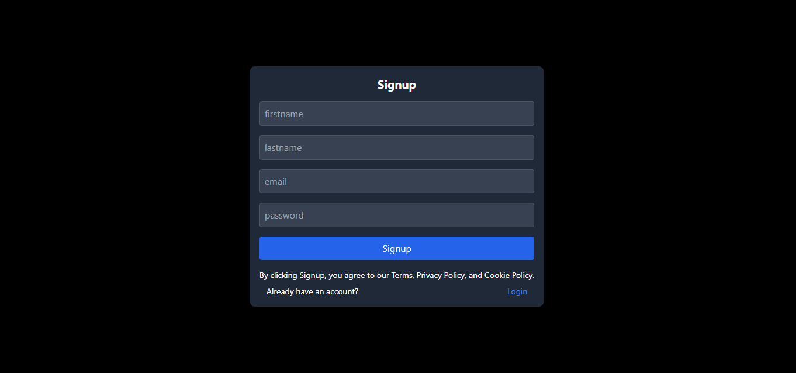
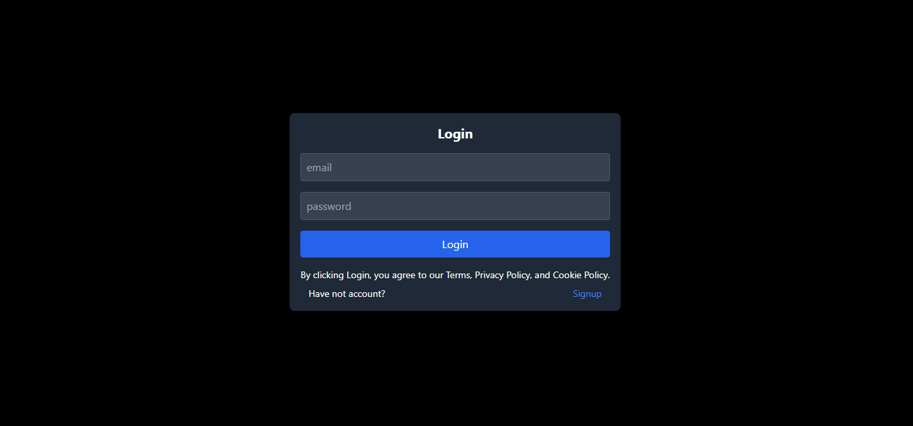
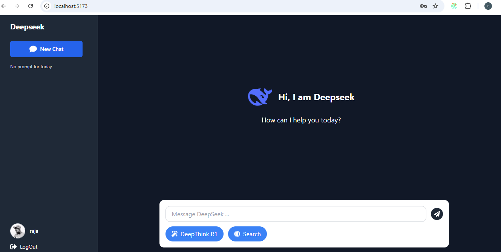
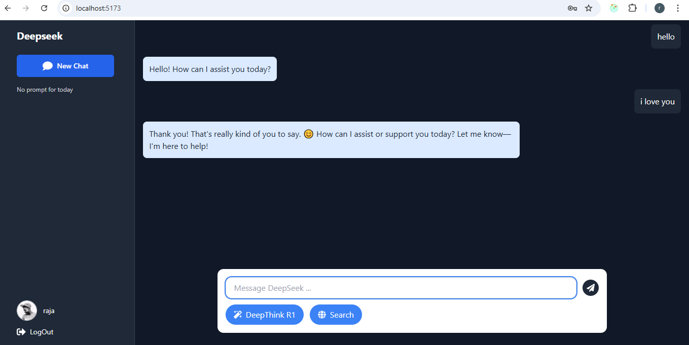

# 🤖 DeepSeek Clone (MERN + OpenAI + Tailwind CSS)

Welcome to my fully functional and responsive **DeepSeek Clone** project. Built using the **MERN stack** with **React.js**, **Tailwind CSS**, and **MongoDB**, this project replicates the DeepSeek-style AI chat functionality. Redux is used for state management, and OpenAI's API is integrated to provide AI-generated responses dynamically.

---

## 🌐 Live Demo

🚀 **Frontend (React App):** [deepseek-client.netlify.app](https://deepseek-client.netlify.app/)

---

## 🚀 Features

- 🔐 **User Authentication** (Signup/Login)
- 🧠 **AI-Powered Responses** via **OpenAI API**
- 🧾 **Redux** for advanced state management
- 🎨 Fully modern UI with **Tailwind CSS**
- ⚙️ Built with **React.js** (Frontend) and **Node.js/Express.js** (Backend)
- 💾 **MongoDB** for secure and scalable data storage
- 📱 100% **Responsive Design** for all devices

---

## 🖼️ Screenshots

### 📝 Signup Page  

### 🔐 Login Page  

### 🏠 Home Page  

### 💬 Prompt / AI Response Page  

---

## 🛠️ Tech Stack

### **Frontend**
- React.js
- Redux Toolkit
- Tailwind CSS
- Axios

### **Backend**
- Node.js
- Express.js
- MongoDB (via Mongoose)
- OpenAI API Integration
- JWT (Authentication)
